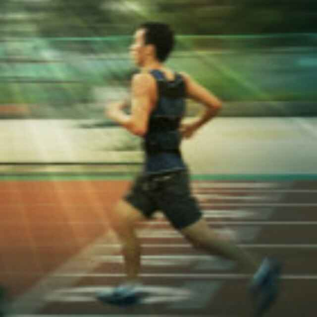

## 基本资料
姓名：陈良静
性别：男
籍贯：江西樟树
生日：1991/11/29
坐标：深圳

## 业余兴趣爱好
长跑、读书、音乐

## 书单
- #### 技术类 
[《iOS开发进阶》-唐巧](https://book.douban.com/subject/26287173/)[《Swifter-100个swift开发必备Tip》-王巍](https://book.douban.com/subject/26386453/)
[《程序员的自我修养》]()
[《Effective Objective-C 2.0》]()
[《Objective-C 高级编程》]()
[《iOS 测试指南》]()
[《iOS Programmming》]()
[《图解 TCP/IP》]()
[《Swift 进阶》]()
[《函数式 Swift》]()
[《Pro Swift》]()
[《RxSwift Reactive Progarmming With Swift》]()
[《CFHipsterRef》]()
[《iOS Apprentice》系列-Swift Apprentice、Checklists、MyLocations、StoreSearch]()
[iOS 10 by Turorials]()
[《Core Data by Tutorials》]()
[《iOS Animation by Tutorials》]()
[《Motion Design for iOS》](https://github.com/Cloudox/Motion-Design-for-iOS)
[《全栈增长工程师指南》]()

- #### 非技术类
[《生活的艺术》-林语堂](https://book.douban.com/subject/1492634/)、[《吾国与吾民》-林语堂](https://book.douban.com/subject/1491239/)、[《MacTalk 人生元编程》-池建强](https://book.douban.com/subject/25826578/)、[《MacTalk 跨越边界》-池建强](https://book.douban.com/subject/26663519/)、[《跑步圣经》- [美] 希恩 ](https://book.douban.com/subject/2340062/)、[《当我谈跑步时我谈些什么》-[日] 村上春树 ](https://book.douban.com/subject/3369600/)、[《挪威的森林》- [日] 村上春树 ](https://book.douban.com/subject/1046265/)、[《场景革命》- 吴声](https://book.douban.com/subject/26575141/)、[《重新定义公司》-[美]埃里克·施密特 ](https://book.douban.com/subject/26582822/)、[《霜冷长河》-余秋雨](https://book.douban.com/subject/1075495/)、[《山居笔记》-余秋雨](https://book.douban.com/subject/1001204/)、[《行者无疆》-余秋雨](https://book.douban.com/subject/1054889/)、[《皮囊》-蔡崇达](https://book.douban.com/subject/26278687/)
- #### 想读
[《暗时间》-刘未鹏](https://book.douban.com/subject/6709809/)、[《把时间当作朋友》-李笑来](https://book.douban.com/subject/3609132/)、[《黑客与画家》-[美] Paul Graham](https://book.douban.com/subject/6021440/)、[《如何阅读一本书》-[美] 莫提默·J. 艾德勒 / 查尔斯·范多伦](https://book.douban.com/subject/1013208/)、[《自品牌》- [美] 丹·斯柯伯尔(Dan Schawbel)](https://book.douban.com/subject/26687512/)

## 马拉松
- #### 已完成
	- 2012建发厦门国际马拉松（3：50）
	- 2013建发厦门国际马拉松（3：59)
	- 2014建发厦门国际马拉松（3：53)
	- 2014北京现代国际马拉松（3：28)
	- 2015建发厦门国际马拉松（5：50)
	- 2016香港渣打国际马拉松（4：50)
	- 2017建发厦门国际马拉松（5：38）
- #### 想参加
    - 2017深圳国际马拉松
    - 2017广州国际马拉松

## 正在学习
HTML5、Swift、python
## 格言
> 孤独是一种选择。自律，自信，自强，成就自我！

## 联系我
[GitHub](https://github.com/ljchen1129)
[新浪微博](http://weibo.com/u/3240004000?topnav=1&wvr=6&topsug=1&is_all=1)
微信

